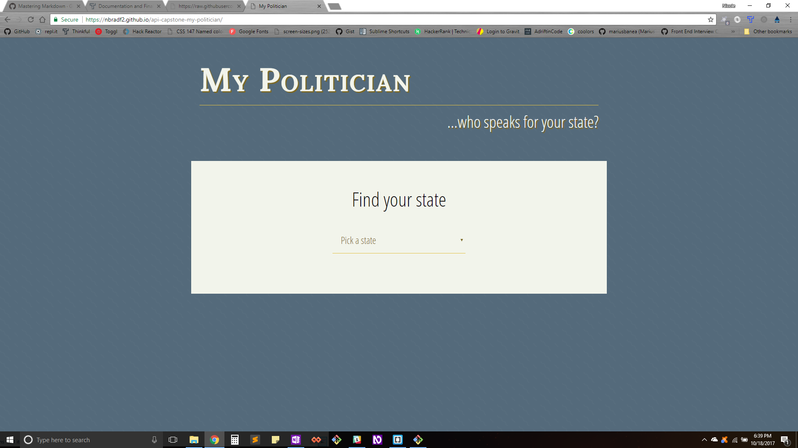
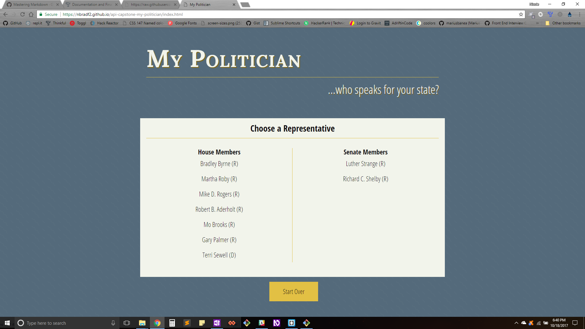
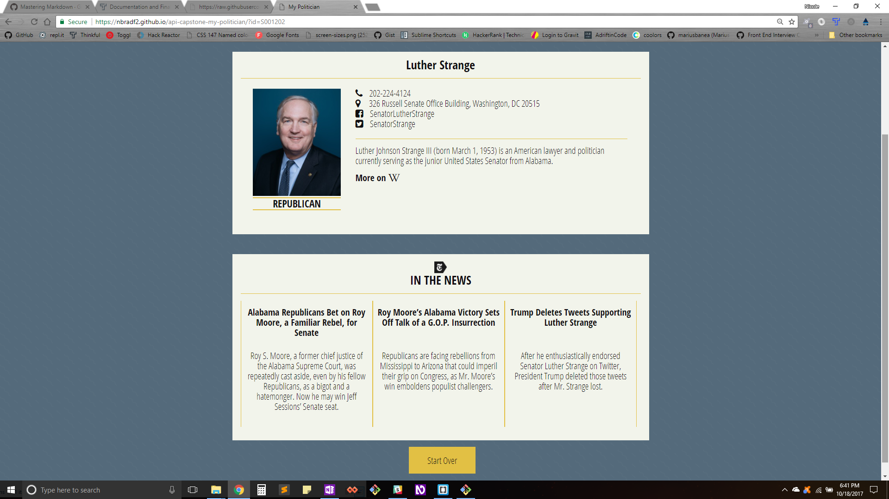

# My Politician
<a href="https://www.thinkful.com">Thinkful</a> API Capstone Project - Front End app integrating ProPublica Congress API

## Background
Having little to no knowledge of who my state politicians are, I wanted to create an app that will look up politicians by state, and provide information about them.

## Use Case
This app will help users find out who their state politicians are, what political party they represent, general information about them, and recent news articles relating to them.

## Functionality
This app's functionality includes:
    * Search for House Representatives by State
    * Search for Senate Representatives by State
    * Return information from Wikipedia and news articles from the New York Times

## Technology
### Front End
    * HTML
    * CSS
    * JavaScript
    * jQuery

The app uses AJAX JSON calls to <a href="https://projects.propublica.org/api-docs/congress-api/">ProPublica Congress</a>, <a href="https://www.mediawiki.org/wiki/API:Main_page">Wikipedia</a>, and the <a href="http://developer.nytimes.com/">New York Times</a> to return search results.

## Responsive
This app is built to be responsive across mobile, tablet, laptop, and desktop screens.

## Development
Future updates are expected to include:
    * Search by zipcode
    * Include local government
